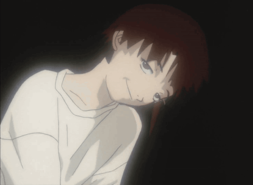

  

<h1 align="center">Hi, I'm Alexander</h1>
<h2 align="center">Software developer from Russia (want to be a hardware developer)</h2>

<h1 align="center">A little about me:</h1>

## What I do?
- I writing desktop utils, compilers and other funny things

## What I know/learning/want to learn?
### know:
- C
### learning:
- python
- Rust
### want to learn:  
- C++

## I'm currently working on:
### [Compiler for my programming language](https://github.com/zzzZoriX/Shine.git)

## My other projects:
### [Tetris written on C](https://github.com/zzzZoriX/Tetris_on_C.git)
### [Transpiler for my own programming language](https://github.com/zzzZoriX/queue_c_compiler.git)
### [My simple 32bit OS](https://github.com/zzzZoriX/AnOS.git)
